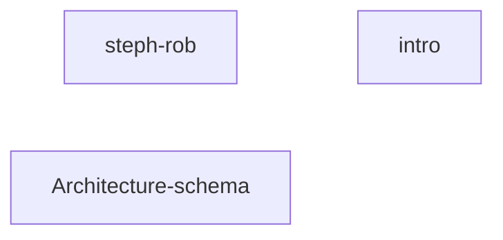
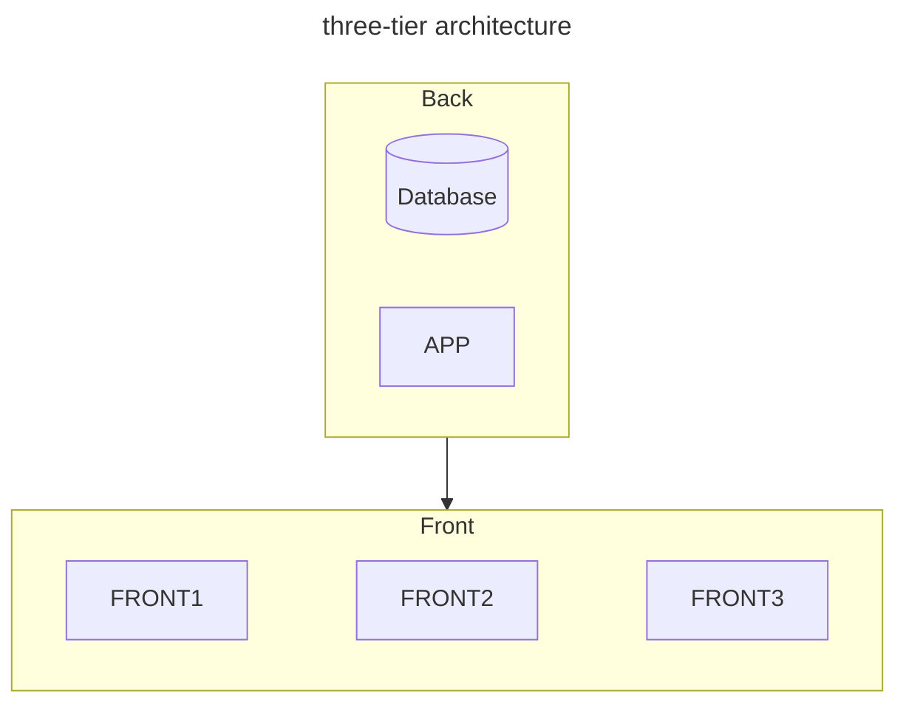

# Bonus links and mermaid
## links




### steph-rob

- [configuration-devops-tools-2022](https://blog.stephane-robert.info/post/configuration-devops-tools-2022/)
- [vagrant-box-git-repo](https://github.com/stephrobert/my-vagrant-box)

### xavki

- [Xavky-playlists](https://www.youtube.com/@xavki/playlists)
- [Xavky-gitlab](https://www.youtube.com/playlist?list=PLn6POgpklwWrRoZZXv0xf71mvT4E0QDOF)

### Cocadmin
- [Cocadmin](https://cours.cocadmin.com/)


## yaml highlighting
```yaml
- hosts: localhost
  gather_facts: false
  tasks:
  - debug:
      msg: youhou
```

## nice jsx

```jsx title="/src/components/HelloCodeTitle.js"
function HelloCodeTitle(props) {
  return <h1>Hello, {props.name}</h1>;
}
```
## Architecture schema

